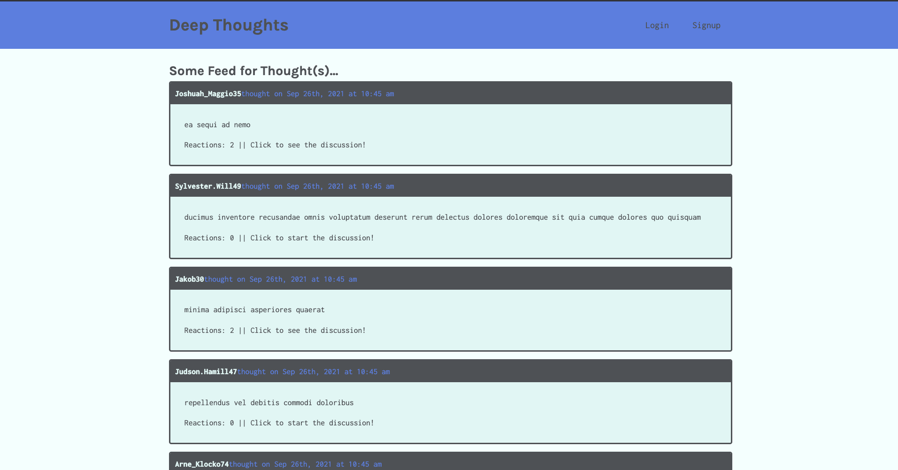
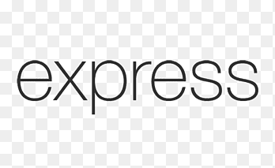

# deep-thoughts

social media application

<br>


## Table of Contents

- [Description](#description)
- [Installation](#installation)
- [Purpose](#purpose)
- [Contributing](#contributing)
- [Issues](#issues)
- [Tests](#tests)
- [Dependencies_Used](#dependencies)

## Description

A social media application to share thoughts and reactions with friends.

## Installation

For developers looking to develop something similar to this app, you must install [Node.js](https://nodejs.org/en/). Once you have Node.js installed, then install Node Package Manager(npm).

first...

```
npm init -y
```

then...

```
npm install create-react-app
```

Other dependencies added are graphql, mongoose, node.js, express, react, apollo-server-express, jsonwebtoken, material-ui, bcrypt.

## Purpose


This project was built to showcase a design for social media app components.

## License


<br />
This application is not currently covered by any license, but was crafted with the open source community in mind.

## Contributing

With support and assistance from the developer community at large.

## Issues

There may be slight challenges with all functionality as of initial deployment

## Testing

No testing was done for this app

## Dependencies

<p>





</p>
